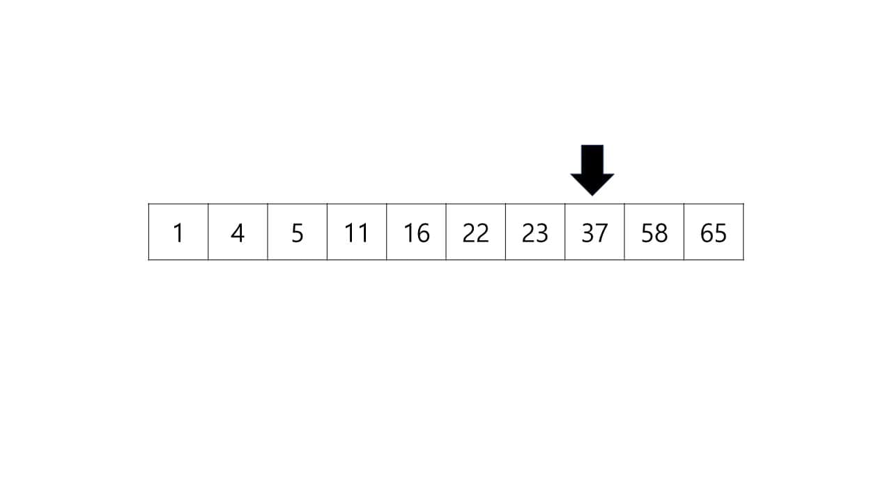

# Binary Search

이진 탐색은 정렬되어 있는 배열의 중간 데이터와 찾고자 하는 데이터의 값을 비교하여 탐색하는 방법이다.

이진 탐색은 값을 비교하여야 하기 때문에 정렬된 배열이여야 한다는 점이 있다.

만약 다음과 같은 배열에서 23을 찾는다고 하면 중간값인 16과 비교한다.

16은 23보다 작으니 16의 뒤쪽 배열 중간값인 37과 비교한다.

37은 23보다 크니 앞쪽 배열 16이상과 37 사이의 중간값인 22와 비교한다.

22는 23보다 작으니 그 다음 중간값인데 그 값은 이제 하나이고 찾고자 하는 데이터인 23이다.