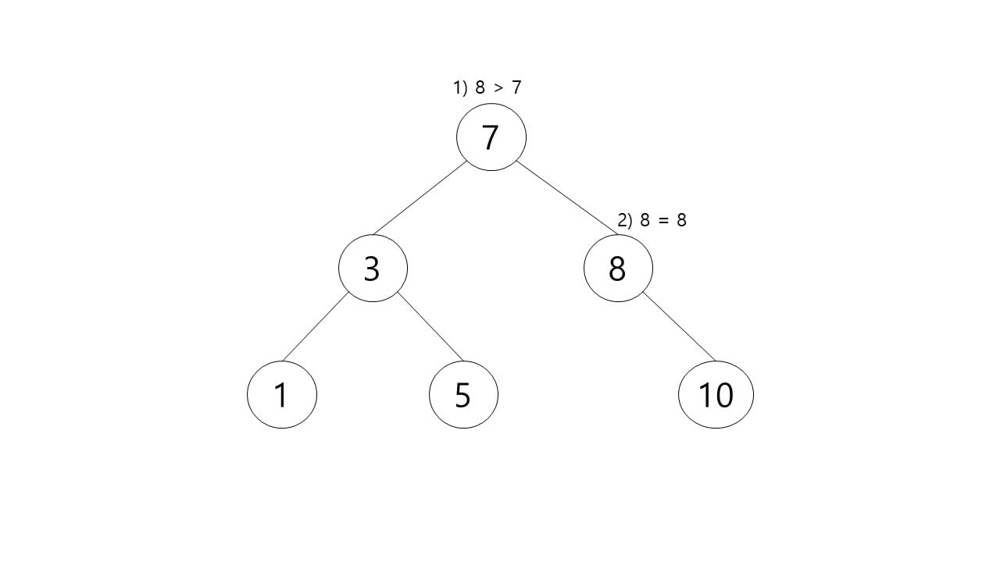
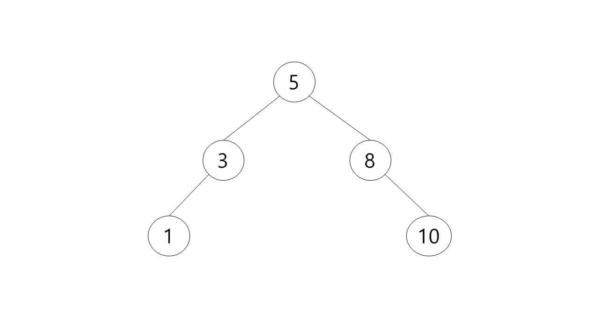
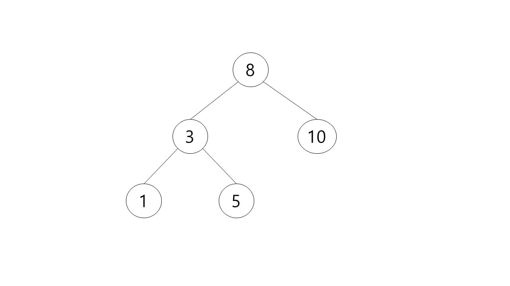

# Binary Search Tree

이진 탐색 트리란 이진 트리에서 데이터를 탐색하는 방법이다.
이진 탐색 트리란 정렬된 이진 트리로서 다음과 같은 특징을 가지고 있다.

루트 노드의 왼쪽 하위 트리에는 루트 노드의 데이터보다 작은 노드만 포함된다.
루트 노드의 오른쪽 하위 트리에는 루트 노드의 데이터보다 큰 노드만 포함된다.
왼쪽 및 오른쪽 하위 트리도 각각 이진 트리여야 한다.
중복된 키를 허용하지 않는다.

이진 탐색 트리의 탐색
1. 루트 노드와 찾고자 하는 데이터를 비교한다. 일치한다면 탐색을 종료한다.
2. 찾고자 하는 값이 루트 노드보다 작다면 왼쪽 서브 트리로 이동하여 탐색을 다시 진행한다.
3. 찾고자 하는 값이 루트 노드보다 크다면 오른쪽 서브 트리로 이동하여 탐색을 다시 진행한다.

만약 위와 같은 트리에서 찾고자 하는 값이 5일 때, 다음과 같은 탐색 과정이 진행된다.
1. 루트 노드인 7과 비교한다. 루트 노드보다 작으니 왼쪽 서브 트리로 이동한다.
2. 루트 노드인 3과 비교한다. 루트 노드보다 크니 오른쪽 서브 트리로 이동한다.
3. 루트 노드인 5와 비교한다. 일치한다.

찾는 값이 트리에 존재하지 않더라도 트리의 높이만큼의 탐색을 진행한다.

이진 탐색 트리 삽입
1. 삽입할 값을 루트 노드와 비교해 같다면 오류를 발생한다( 중복 값 허용 X )
2. 삽입할 값이 루트 노드의 키보다 작다면 왼쪽 서브 트리를 탐색해서 비어있다면 추가하고, 비어있지 않다면 다시 값을 비교한다.
3. 삽입할 값이 루트 노드의 키보다 크다면 오른쪽 서브 트리를 탐색해서 비어있다면 추가하고, 비어있지 않다면 다시 값을 비교한다.

만약 위와 같은 트리에서 삽입하고자 하는 값이 6일 때, 다음과 같은 탐색 과정이 진행된다.
1. 삽입할 값을 루트 노드와 비교한다. 6은 7보다 작으니 왼쪽 서브 트리로 이동한다.
2. 삽입할 값을 루트 노드와 비교한다. 6은 3보다 크니 오른쪽 서브 트리로 이동한다.
3. 삽입할 값을 루트 노드와 비교한다. 6은 5보다 크니 오른쪽 서브 트리로 이동한다.
4. 비교할 루트 노드가 없다. 데이터를 삽입한다.

이진 탐색 트리의 삭제(delete)
이진탐색트리의 삭제는 삽입보다 조금 더 복잡하다. 이진 탐색 트리에서 특정 노드를 삭제할 때 아래와 같은 3가지 상황을 나누어 구현해야 한다.

1. 삭제하려는 노드가 단말 노드(leaf node) 일 경우
2. 삭제하려는 노드의 서브 트리가 하나인 경우(왼쪽 혹은 오른쪽 서브 트리)
3. 삭제하려는 노드의 서브 트리가 두 개인 경우

자식이 없는 단말 노드의 삭제는 간단하다. 삭제할 노드의 부모 노드가 있다면 부모 노드의 자식 노드를 NULL로 만들고, 삭제할 노드를 삭제(메모리 해제) 해주면 된다.
만약 위와 같은 트리에서 삭제하고자 하는 값이 6일 때, 다음과 같은 삭제 과정이 진행된다.
1. 삭제할 값을 루트 노드와 비교한다. 6은 7보다 작으니 왼쪽 서브 트리로 이동한다.
2. 삭제할 값을 루트 노드와 비교한다. 6은 3보다 크니 오른쪽 서브 트리로 이동한다.
3. 삭제할 값을 루트 노드와 비교한다. 6은 5보다 크니 오른쪽 서브 트리로 이동한다.
4. 삭제할 값을 루트 노드와 비교한다. 동일한 데이터 값을 가지고 있으니 삭제한다.

삭제하려는 노드의 서브 트리가 하나인 경우도 간단하다. 삭제할 노드의 자식 노드를 삭제할 노드의 부모 노드가 가리키게 하고 해당 노드를 삭제하면 된다.
만약 위와 같은 트리에서 삭제하고자 하는 값이 8일 때, 다음과 같은 삭제 과정이 진행된다.

1. 삭제할 값을 루트 노드와 비교한다. 8은 7보다 크니 오른쪽 서브 트리로 이동한다.
2. 삭제할 값을 루트 노드와 비교한다. 동일한 데이터 값을 가지고 있으니 삭제한다.

3. 8의 자식 노드였던 10을 8의 부모 노드였던 7에 연결한다.

삭제하려는 노드의 서브트리가 두 개인 경우는 가장 복잡하다. 이 경우 두 가지 방법을 사용할 수 있다.

1) 삭제할 노드 왼쪽 서브 트리의 가장 큰 자손을 해당 노드의 자리에 올린다.
1. 루트(서브) 노드 7을 삭제할 때, 왼쪽 서브 트리의 가장 큰 자손인 5를 루트 노드로 이동시킨다.
2. 만약 이동 시킨 노드에게 자식 노드가 있었다면 원래 자리의 부모 노드에게 연결한다. 없다면 그대로 유지한다.

2) 삭제할 노드 오른쪽 서브 트리의 가장 작은 자손을 해당 노드의 자리에 올린다.
1. 루트(서브) 노드 7을 삭제할 때, 오른쪽 서브 트리의 가장 작은 자손인 8을 루트 노드로 이동시킨다.
2. 만약 이동 시킨 노드에게 자식 노드가 있었다면 원래 자리의 부모 노드에게 연결한다. 없다면 그대로 유지한다.