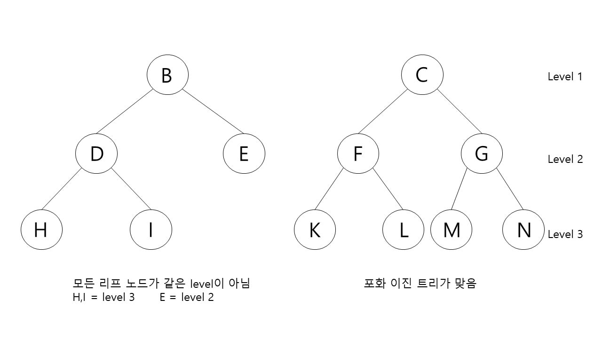

# Binary tree

이진 트리는 트리 중 한 종류로써 자식 노드가 둘 이하로 이루어진 트리이다.

전 이진 트리(full binary tree or strict binary tree)는 모든 노드가 0개 또는 2개의 자식 노드를 가진 트리이다.

완전 이진 트리(complete binary tree)는 마지막 레벨을 제외하고 모든 레벨이 완전히 채워진 트리이다. 마지막 레벨은 완전히 채워지지 않아도 되지만 왼쪽부터 채워져야 한다.

포화 이진 트리(perfect binary tree)는 모든 노드가 두 개의 자식 노드를 가지며 모든 리프 노드가 레벨이 동일해야 한다.

균형 이진 트리(balanced binary tree)는 왼쪽과 오른쪽 트리의 깊이(depth) 차이가 1만큼 난다.

이진 탐색 트리는 이진트리이면서 다음과 같은 속성을 갖는 트리를 뜻한다.

1) 이진 탐색 트리의 노드에 저장된 값은 유일하다.
2) 부모 노드의 값은 왼쪽 자식 노드의 값보다 크다.
3) 부모 노드의 값은 오른쪽 자식 노드의 값보다 작다.

이진 탐색 트리는 효율적인 탐색을 위해 고안된 트리이다. 