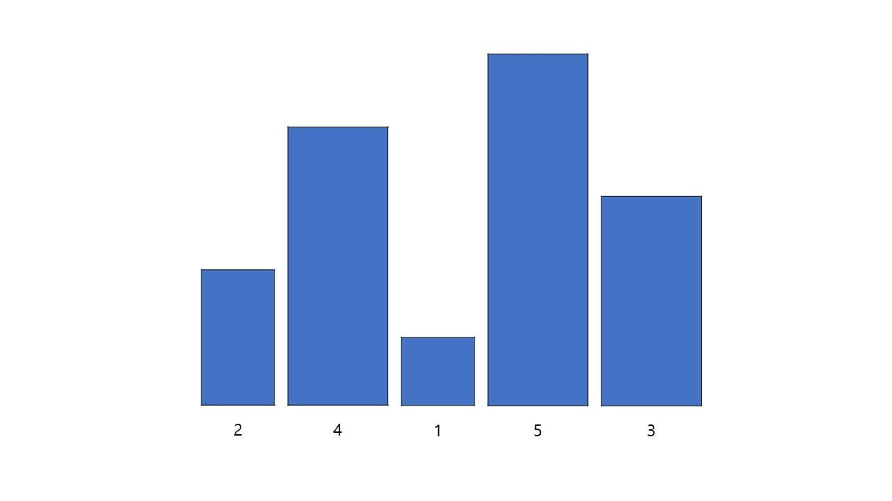
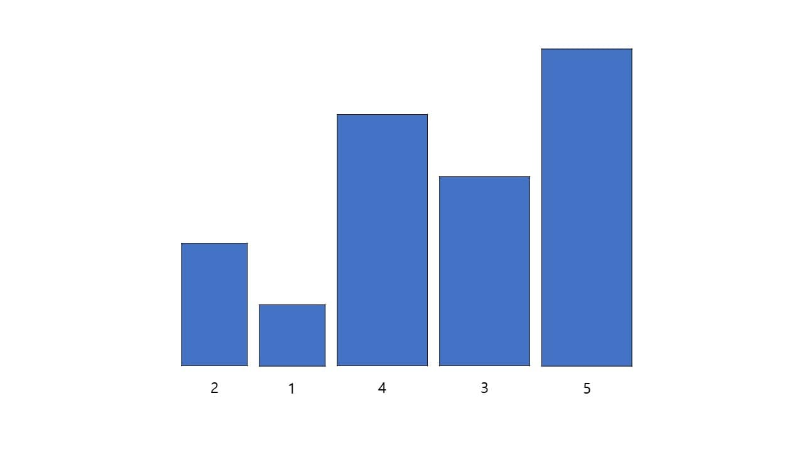
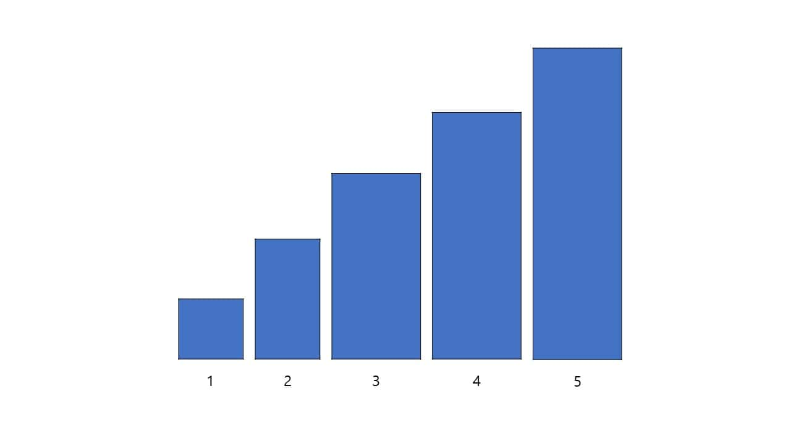

# Bubble sort

거품 정렬은 서로 인접한 두 원소의 크기를 비교하고 차례로 옮겨 크기 순으로 정렬하는 방법이다.

거품 정렬을 하기 위한 초기 원소

첫 번째 원소인 2와 두 번째 원소인 4를 비교한다. 첫 번째 원소보다 두 번째 원소가 크니 그대로 유지한다.
두 번째 원소인 4와 세 번째 원소인 1을 비교한다. 두 번째 원소가 세 번째 원소보다 더 작으니 세 번째 원소를 두 번째로 이동한다.
세 번째 원소가 된 4와 네 번째 원소인 5를 비교한다. 세 번째 원소보다 네 번째 원소가 크니 그대로 유지한다.
네 번째 원소인 5와 다섯 번째 원소인 3을 비교한다. 네 번째 원소보다 다섯 번째 원소가 더 작으니 다섯 번째 원소를 네 번째로 이동한다.
이제 다섯 번째 원소는 가장 큰 원소이므로 앞으로 비교하지 않는다.

첫 번째 원소인 2와 두 번째 원소인 1을 비교한다. 두 번째 원소가 첫 번째 원소보다 더 작으니 두 번째 원소를 첫 번째로 이동한다.
두 번째 원소가 된 2와 세 번째 원소인 4를 비교한다. 두 번째 원소보다 세 번째 원소가 크니 그대로 유지한다.
세 번째 원소인 4와 네 번째 원소인 3을 비교한다. 네 번째 원소가 세 번째 원소보다 작으니 네 번째 원소를 세 번째로 이동한다.
이제 네 번째 원소는 다섯 번째 원소 다음으로 큰 원소이므로 앞으로 비교하지 않는다.

첫 번째 원소인 1과 두 번째 원소인 2를 비교한다. 첫 번째 원소보다 두 번째 원소가 크니 그대로 유지한다.
두 번째 원소인 2와 세 번째 원소인 3을 비교한다. 두 번째 원소보다 세 번째 원소가 크니 그대로 유지한다.
이제 세 번째 원소는 네 번째 원소 다음으로 큰 원소이므로 앞으로 비교하지 않는다.

첫 번째 원소인 1과 두 번째 원소인 2를 비교한다. 첫 번째 원소보다 두 번째 원소가 크니 그대로 유지한다.
이제 두 번째 원소는 세 번째 원소 다음으로 큰 원소이므로 앞으로 비교하지 않는다.
