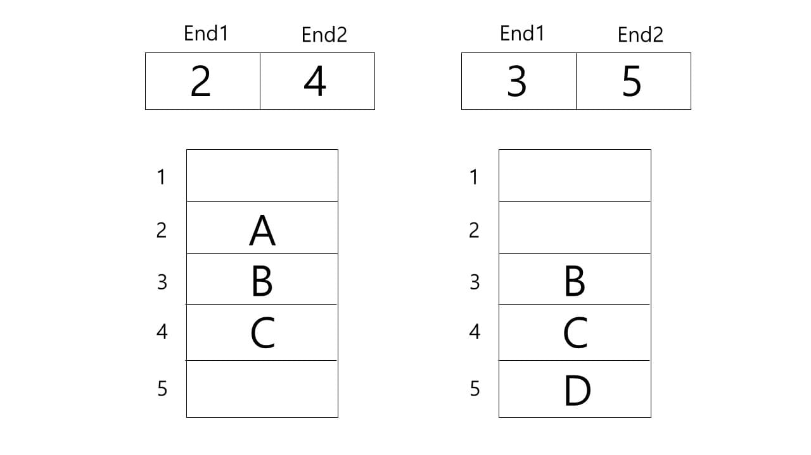
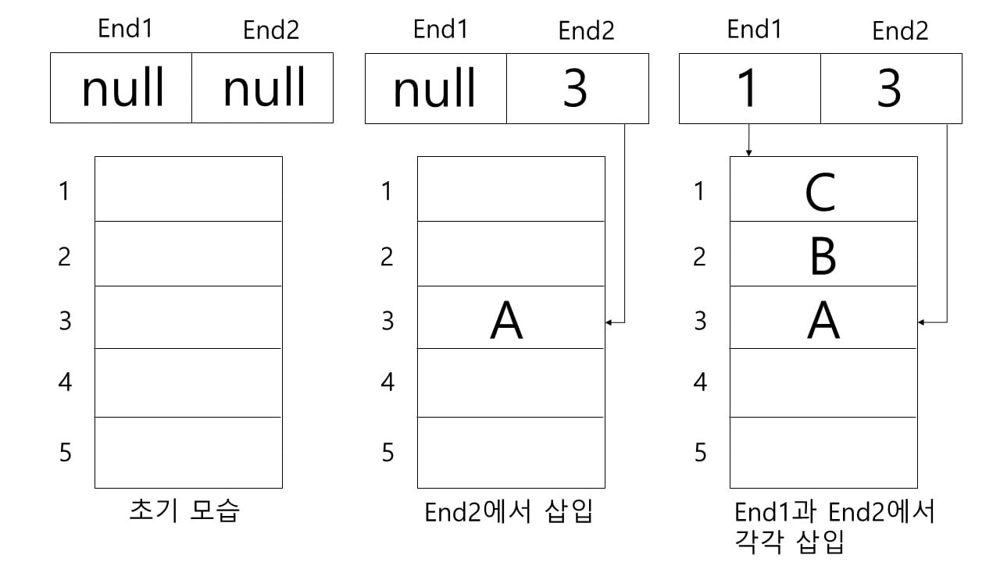
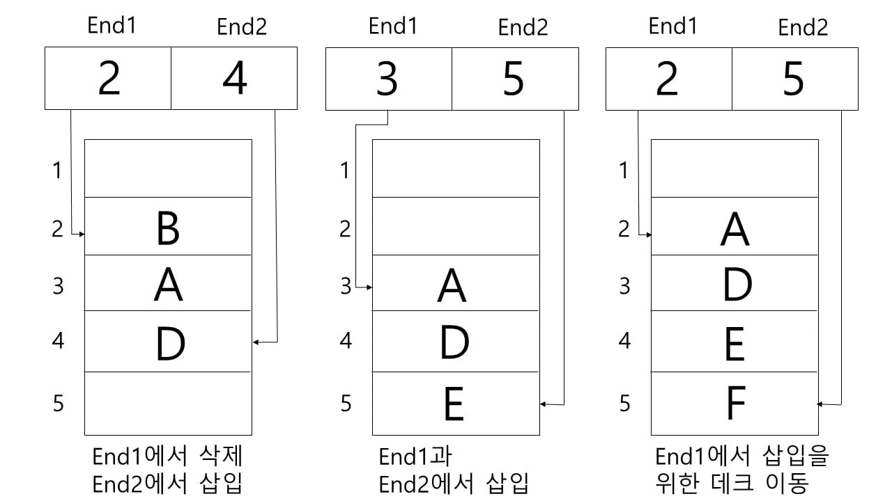
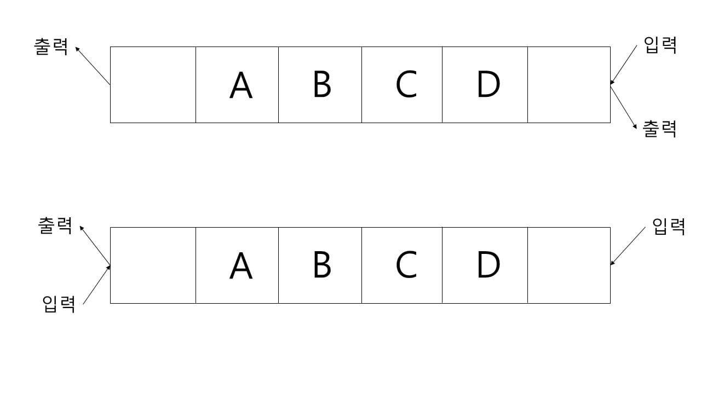

# Duque

double-ended-queue의 약자로 리스트의 양쪽 끝에서 삽입과 삭제가 일어나는 선형 리스트

end1 : 데이터의 삽입과 삭제가 일어나는 가장 끝 부분 포인터(주소)

end2 : end1의 가장 반대편에서 데이터의 삽입과 삭제가 일어나는 끝 부분 포인터(주소)

\*데크 포인터는 삽입이 일어나는 부분, 삭제가 일어나는 부분 각각 1개씩 총 2개의 포인터를 사용한다.

데크는 양쪽 끝에서 삽입과 삭제가 일어나는데, 이를 각각 가리키는 포인터를 End1, End2라고 한다.

데크는 선형 리스트 구조로써 End1과 End2가 각각 스택의 top을 가리키는 모양이라고 볼 수 있다. 또한 스택과 큐에서처럼 빈 데크에서 데이터를 삭제하려 하면 Underflow(언더플로우)가 발생할 수 있다.

데크는 원칙적으로 양쪽 끝에서 삽입과 삭제가 모두 가능하지만, 한쪽 끝에서 출력을 제한함에 따라 입력 제한 데크 또는 스크롤(scroll), 또는 입력을 제한하고 입력 제한 데크 또는 셀프(shelf)라고도 한다.