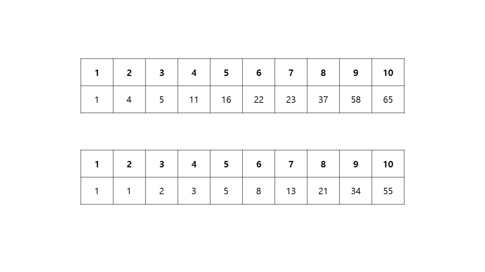
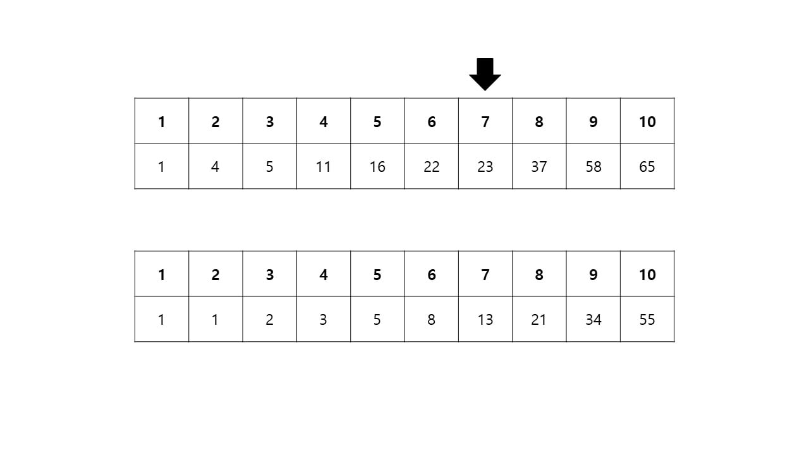
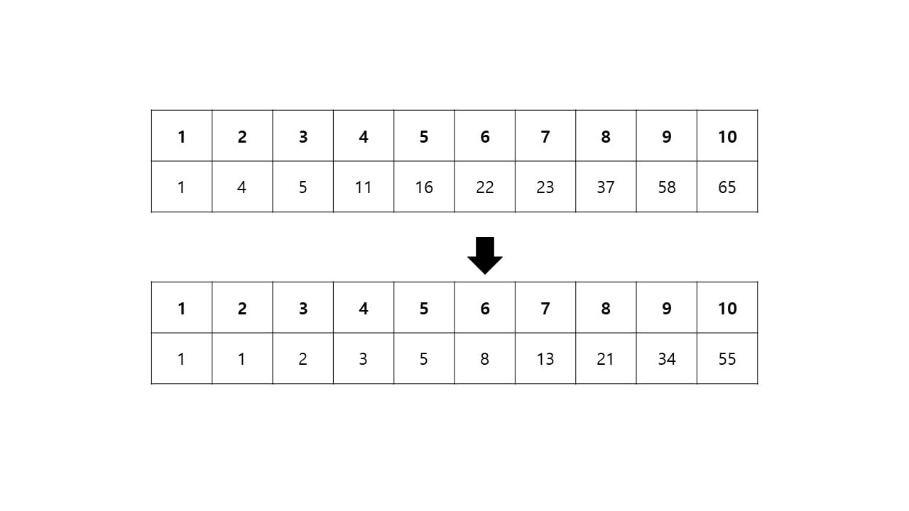
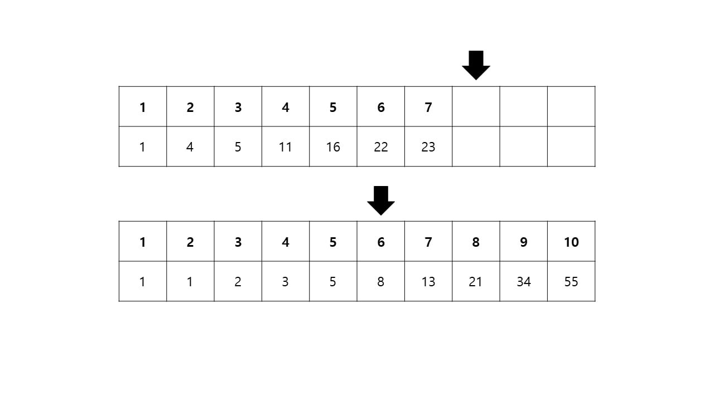
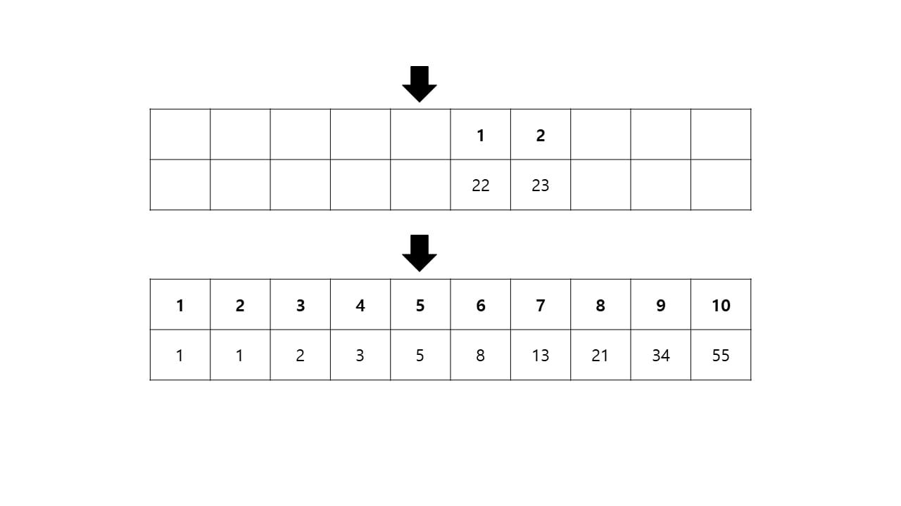

# Fibonacci Search

피보나치 탐색이란 이진 탐색과 비슷하나 탐색할 인덱스를 피보나치 수열로 결정하는 탐색 방법이다.
피보나치 탐색을 수행하려면 다른 탐색들과 같이 정렬이 되어있어야 한다.

피보나치 탐색을 위한 초기 구성

위쪽은 일반 배열이고 아래쪽은 피보나치 수열로 이루어진 배열이다. 위쪽 일반 배열에서 23을 찾는다고 할 때
위쪽 배열에서 어떤 인덱스부터 찾을 건지 아래쪽 피보나치 배열로 결정한다.

먼저 일반 배열과 크기가 같거나 제일 가깝게 작은 피보나치 수열을 찾는다.
일반 배열 전체 크기가 10이고, 피보나치 수열은 인덱스 7에서 13이기 때문에 데이터가 8인 피보나치 배열의 인덱스 6을 선택한다.

피보나치 배열 인덱스 6의 데이터는 8이므로 일반 배열의 인덱스 8을 확인한다.
일반 배열 인덱스 8은 37이며 찾으려고 하는 23보다 크므로 일반 배열의 나머지 인덱스를 버리고 새로운 배열을 생성한다.

피보나치 배열 인덱스 5의 데이터는 5이므로 일반 배열의 인덱스 5를 확인한다.
일반 배열 인덱스 5는 16이고 이는 23보다 작으므로 일반 배열의 나머지 인덱스를 버리고 새로운 배열을 생성한다.

이제 일반 배열의 크기는 2가 되었으므로 피보나치 배열 인덱스 3의 데이터는 2가 되니 일반 배열의 인덱스 2를 확인한다.
찾고자 하는 23이다.