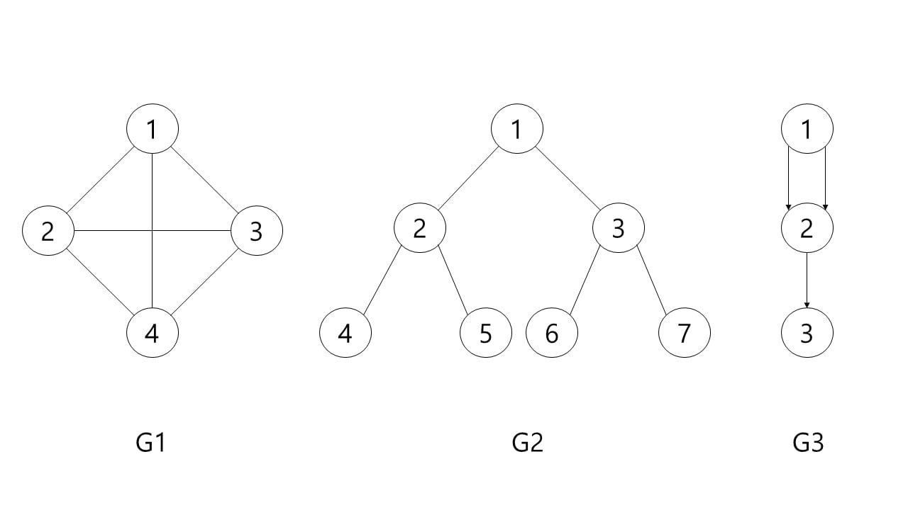
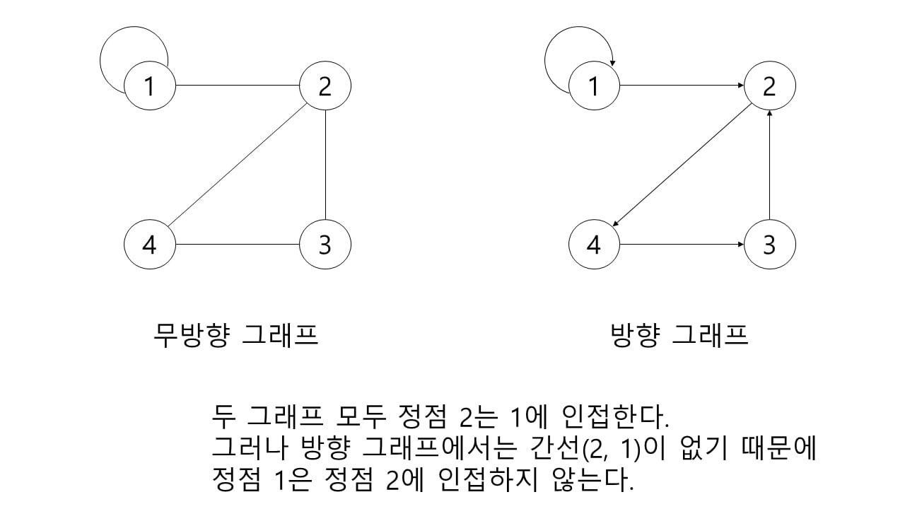
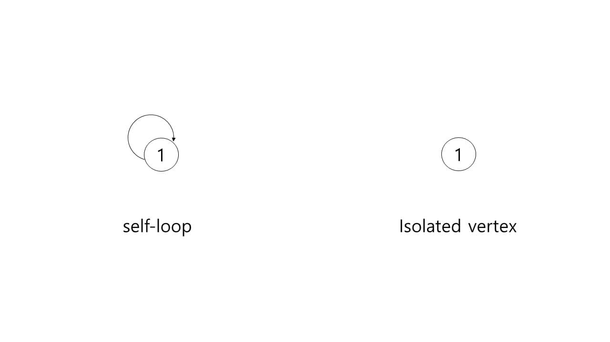
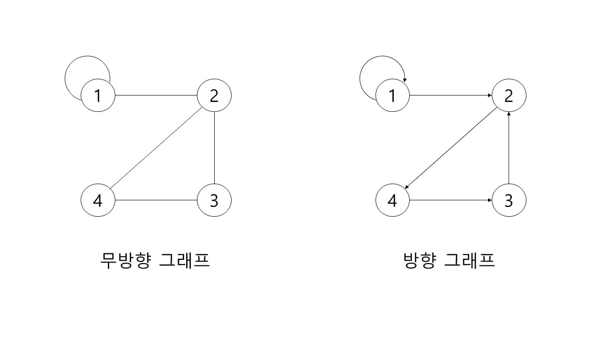
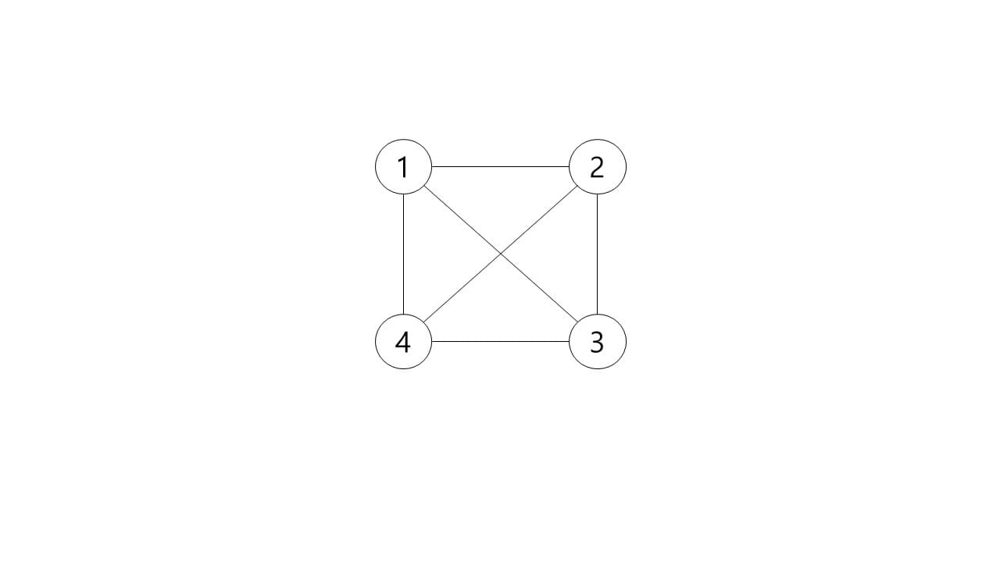
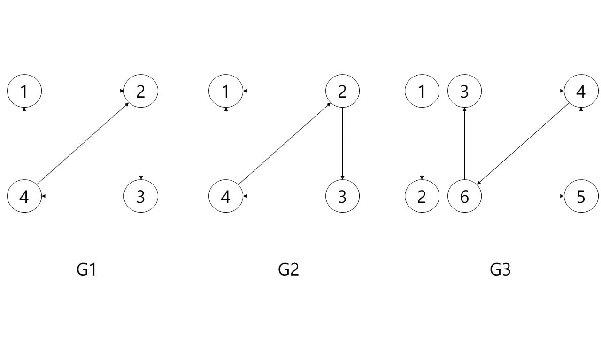
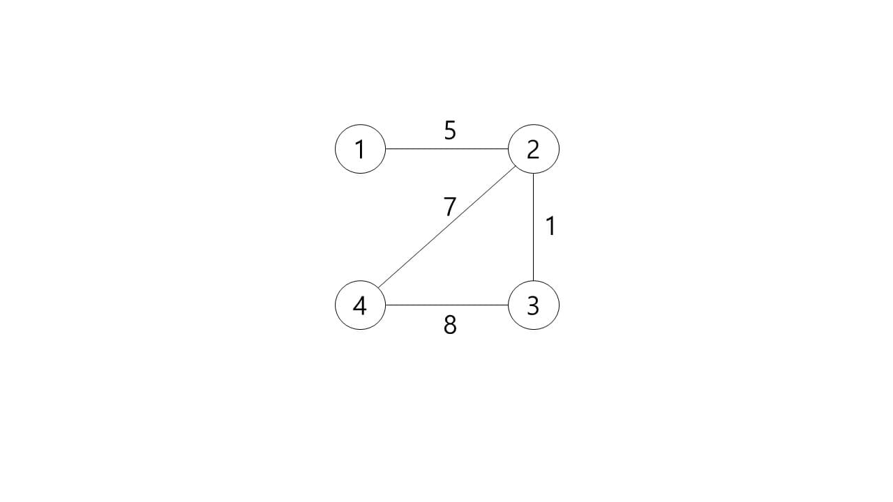
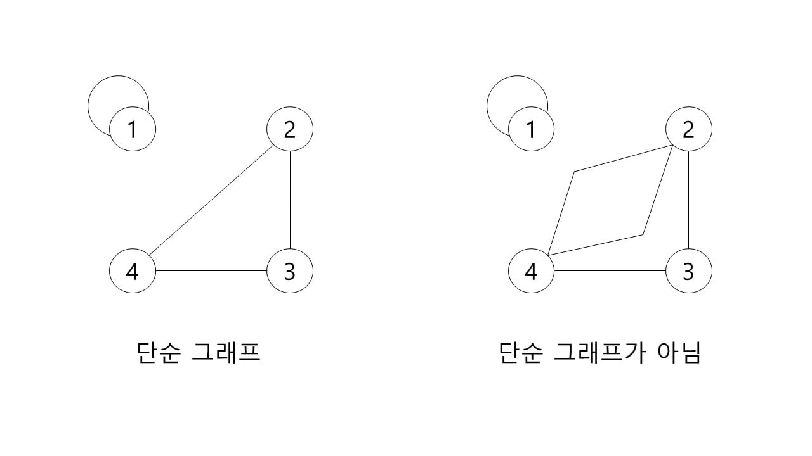
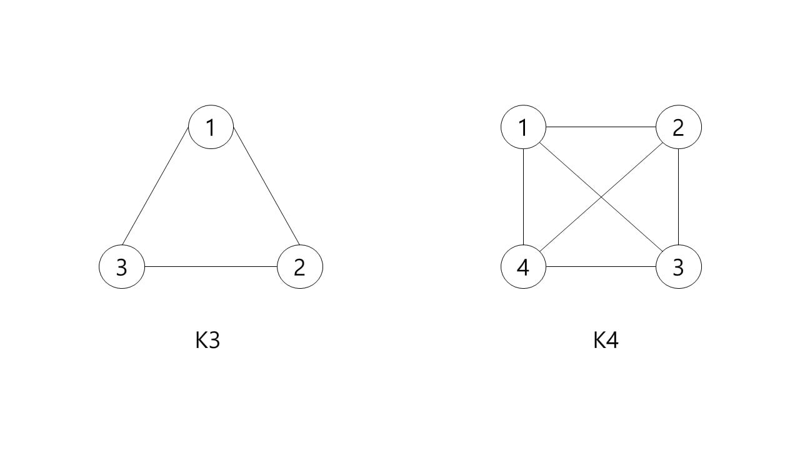

# Graph

그래프(Graph)는 정점(Vertex)의 집합 V와 간선(Edge)의 집합 E로 구성된 비선형 데이터 구조이다.

Vertex : 자료를 저장하려는 자료의 단위, 노드(Node)라고도 말함.

Edge : 정점 사이를 연결하는 선으로 두 정점 쌍 (u, v)로 표현함.

G = (V , E)

G1과 G2는 무방향 그래프, G3는 방향 그래프를 의미한다.

V(G1) = {1, 2, 3, 4}
E(G1) = {(1, 2), (1, 3), (1, 4), (2, 3), (2, 4), (3, 4)}

V(G2) = {1, 2, 3, 4, 5, 6, 7}
E(G2) = {(1, 2), (1, 3), (2, 4), (2, 5), (3, 6), (3, 7)}

V(G3) = {1, 2, 3}
E(G3) = {(1, 2), (2, 1), (2, 3)}

adjacent : 무방향 그래프에서 정점 u, v에 대하여 간선(u, v)가 있으면 정점 u는 정점 v에 인접(adjacent)하다고 한다.(v는 u에 대한 역도 성립)
 방향 그래프에서 정점 u, v에 대하여 간선(u, v)가 있으면 정점 u는 정점 v에 인접(adjacent)하다고 한다.(v는 u에 대한 역은 성립하지 않음)

incident : 무방향 그래프에서 정점 u, v에 대하여 간선(u, v)이 있으면 간선(u, v)은 정점 u와 v에 부속(incident)한다고 한다.

두 그래프 모두 정점 2는 1에 인접한다.
그러나 방향 그래프에서는 간선(2, 1)이 없기 때문에 정점 1은 정점 2에 인접하지 않는다. 

self-loop : 한 간선이 같은 정점에 부속(incident)해 있을 때 self-loop라고 한다. e = (u, u)

isolated : 간선이 없는 정점을 isolated vertex라고 한다.

degree : 차수, 정점에 연결된 간선의 수이며 정점 v의 차수는 d(v)로 표현함

out-degree : 진출 차수, 정점을 나가는 간선의 수

in-degree : 진입 차수, 정점으로 들어오는 간선의 수

방향 그래프에서 차수는 진출 차수와 진입 차수의 합이며 무방향 그래프는 구분없이 차수로만 표현한다.
self-loop의 경우에도 방향 그래프는 진출 차수와 진입 차수가 하나씩, 무방향 그래프는 한 번의 차수를 포함한다.

무방향 그래프 : 
    d(1) = 3 
    d(2) = 3 
    d(3) = 2
    d(4) = 2

방향 그래프 :
    d(1) = out(2) + in(1) = 3
    d(2) = out(1) + in(2) = 3
    d(3) = out(1) + in(1) = 2
    d(4) = out(1) + in(1) = 2

path : 정점 u에서 정점 v까지 도달하기 위한 인접한 정점들의 순서(sequence)이다.

length of path : 경로의 길이, 경로 상의 간선의 수

simple path : 단순 경로, 정점이 중복되지 않는 경로

경로 <1, 2, 4, 1, 3>의 길이는 4이고 0이 중복되어 단순 경로가 아님
경로 <1, 2, 3>의 길이는 2이고 중복되는 정점이 없어 단순 경로이다

cycle : 순환, 경로 중 시작 정점과 끝 정점이 같은 경우

simple cycle : 단일 순환, 처음 정점과 끝 정점을 제외하고 정점이 중복되지 않는 순환

경로 <1, 2, 3, 4, 2, 1>은 순환이다
경로 <1, 2, 4, 1>은 단순 순환이다.

방향 그래프든 무방향 그래프든 두 정점을 포함하는 경로가 있다면 연결(connected), 그렇지 않다면 비연결(disconnected) 되어 있다고 표현 한다.
또한 방향 그래프에서 모든 정점에 대해 임의의 정점 u에서 v로의 경로, v에서 u로의 경로가 존재한다면 해당 그래프는 강연결(strongly-connected) 그래프라 한다.

G1은 어느 정점이든 경로가 존재하여 강연결(strongly-connected) 그래프이다
G2는 연결되어 있지만 정점 0에서 3으로 가는 경로가 없기 때문에 강연결이 아니다
G3는 정점 0에서 2로 가는 경로가 없기 때문에 비연결이다.

가중치 그래프는 각 간선에 가중치 또는 비용이 할당된 그래프이다.

단순 그래프는 중복된 간선과 loop가 없는 그래프이다. 정점의 개수가 n개 일 때 최대 n-1개의 간선을 가질 수 있다.
오른쪽은 정점 2, 4 사이에 중복된 간선이 있고 하나의 loop를 가지고 있기 때문에 단순 그래프가 아님.

완전 그래프는 간선의 수가 최대인 그래프이고 정점의 수가 n개일 때 간선의 수는 n*(n-1)/2이며 Kn으로 표현한다. 