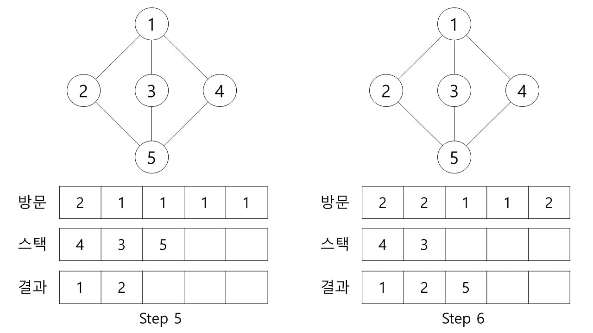
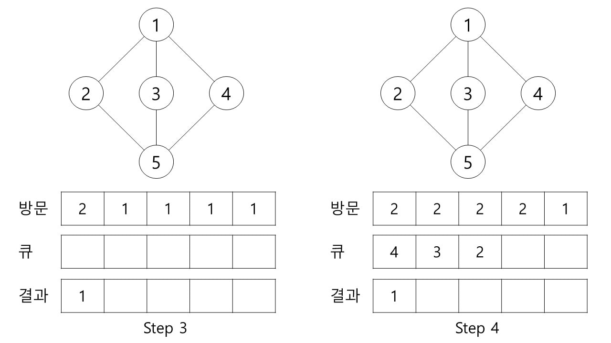

# Graph search

그래프를 구성하는 모든 정점을 방문하는 것을 그래프의 운행이라고 하며, 무방향 그래프는 한 정점에서 다른 모든 정점으로 가는 경로를 운행하는 방법이다.

깊이 우선 탐색(DFS, Depth First Search)는 일반적으로 스택을 사용한다.

1. 시작되는 정점 V를 결정하고, 방문한다.
2. V에 인접한 정점 가운데 방문하지 않은 정점을 방문한다.
3. 모든 인접 정점을 방문한 정점을 만나게 되면, 방문하지 않는 인접 정점을 가졌던 마지막 정점으로 가서 수행한다.
4. 더 이상 방문할 정점이 없으면 완료된다.

Step 1. 시작 정점 1을 스택에 push한다.
Step 2. 스택 맨 위의 정점 1을 pop하고 방문 표시를 한다.

Step 3. pop된 정점 0에서 방문하지 않은 인접한 정점 2, 3, 4를 스택에 push한다.(3, 2, 1 순으로 스택에 저장된다고 가정한다.)
Step 4. 스택 맨 위에 있는 정점 2를 pop하고 방문 표시를 한다.

Step 5. pop된 정점 2에서 방문하지 않은 인접한 정점 5를 스택에 push 한다.
Step 6. 스택 맨 위의 정점 5를 pop하고 방문 표시를 한다.

Step 7. pop된 정점 5에서 방문하지 않은 인접한 정점이 더 이상 없기 때문에 스택 맨 위에 있는 정점 3을 pop하고 방문 표시를 한다.
Step 8. pop된 정점 3에서 방문하지 않은 인접한 정점이 없기 때문에 스택 맨 위에 있는 정점 4를 pop하고 방문 표시를 한다. 스택이 비었기 때문에 탐색을 종료한다.

너비 우선 탐색(BFS, Breath First Search)는 그래프에서 최단 경로를 찾는 정점 기반 알고리즘이다. 일반적으로 큐를 사용한다.

1. 모든 정점을 방문하지 않은 상태로 표시한다.

2. 시작 정점을 방문하여 방문 표시를 하고 큐에 삽입한다.

3. 큐의 첫 번째 정점을 제거하고 첫 번째 정점에서 방문하지 않은 인접한 정점을 방문하여 방문 표시를 하고 큐에 삽입한다.

4. 인접한 정점이 없는 경우 큐에서 첫 번째 정점을 빼온다.

5. 더 이상 방문할 정점이 없으면 완료된다.

Step 1. 모든 정점을 방문하지 않는 상태로 표시한다.
Step 2. 시작 정점 1을 방문하여 방문 표시를 하고 큐에 삽입한다.

Step 3. 큐에서 첫 번째 정점 1을 제거한다.
Step 4. 정점 1과 인접한 정점들 중 방문한 적이 없는 정점 2, 3, 4를 방문하여 방문 표시를 하고 큐에 삽입한다.

Step 5. 큐에서 첫 번째 정점 2를 제거한다.
Step 6. 정점 2과 인접한 정점들 중 방문한 적이 없는 정점 5를 방문하여 방문 표시를 하고 큐에 삽입한다.

Step 7-9. 모든 정점을 방문하였기 때문에 큐에서 정점을 하나씩 제거한다.