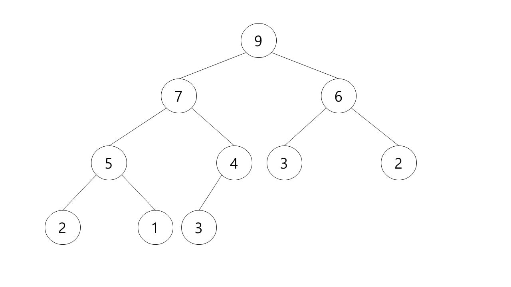

# Heap

자료구조 ‘힙(heap)’이란?
완전 이진 트리의 일종으로 우선순위 큐를 위하여 만들어진 자료구조이다.
여러 개의 값들 중에서 최댓값이나 최솟값을 빠르게 찾아내도록 만들어진 자료구조이며, 일종의 반정렬 상태(느슨한 정렬 상태) 를 유지한다.

부모 노드의 키 값이 자식 노드의 키 값보다 항상 큰(작은) 이진 트리를 말한다.
또한 힙 트리에서는 중복된 값을 허용한다. (이진 탐색 트리에서는 중복된 값을 허용하지 않는다.)

최대 힙(max heap)
부모 노드의 키 값이 자식 노드의 키 값보다 크거나 같은 완전 이진 트리
key(부모 노드) >= key(자식 노드)

최소 힙(min heap)
부모 노드의 키 값이 자식 노드의 키 값보다 작거나 같은 완전 이진 트리
key(부모 노드) <= key(자식 노드)