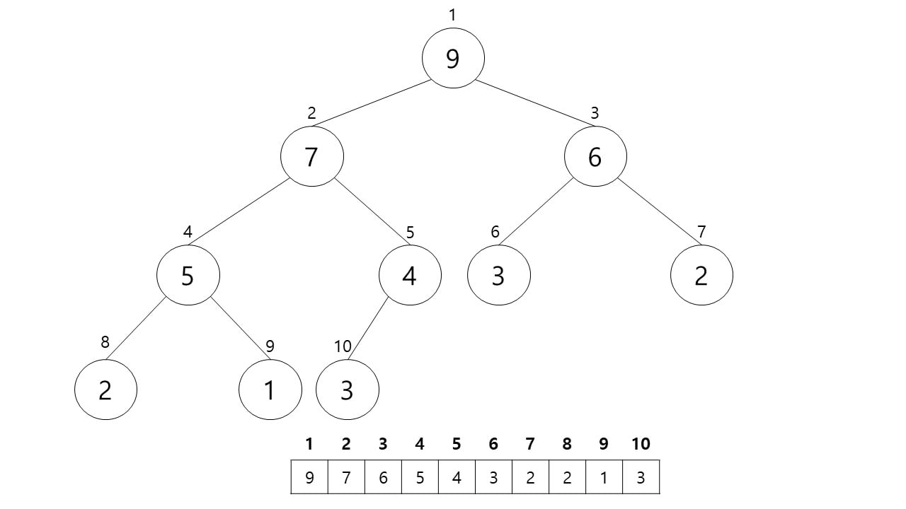
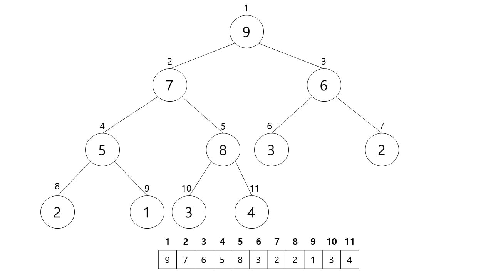
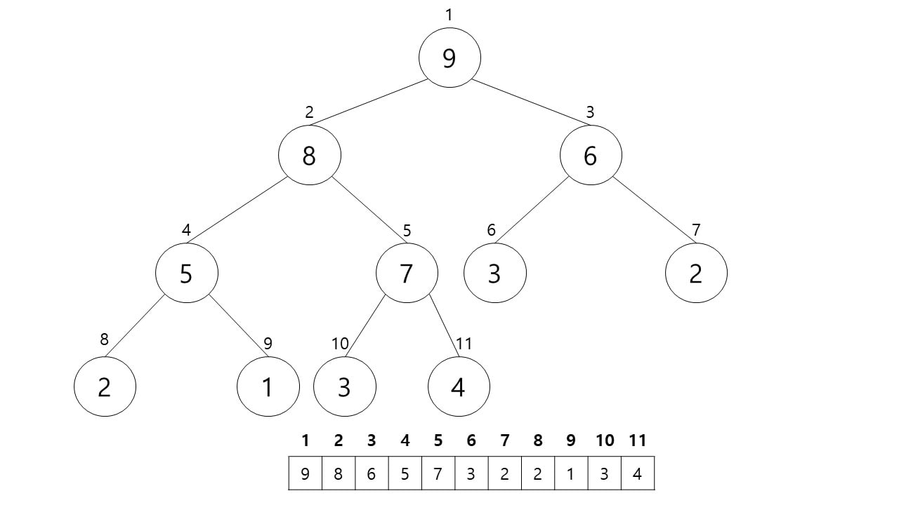
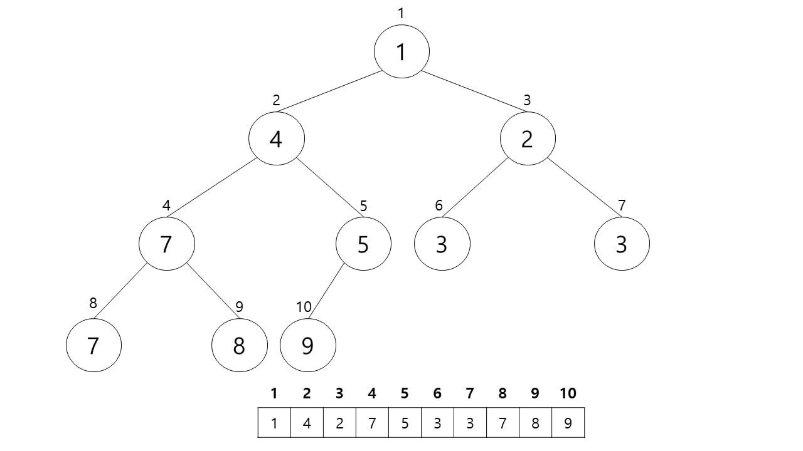
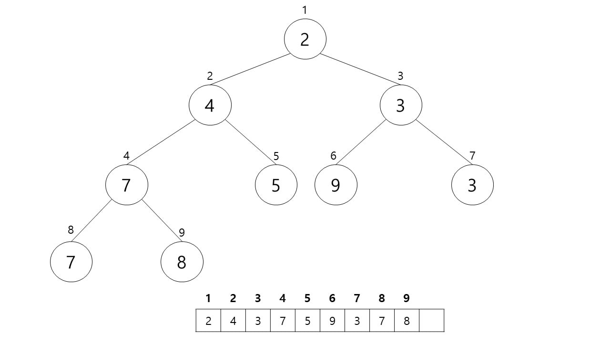

# Heap Sort

힙 정렬이란 힙 자료구조에서 데이터를 최대 힙 또는 최소 힙이 되는 정렬 방법이다.

힙에 새로운 요소가 들어오면, 일단 새로운 노드를 힙의 마지막 노드에 이어서 삽입한다.
새로운 노드를 부모 노드들과 교환해서 힙의 성질을 만족시킨다.
아래의 최대 힙(max heap)에 새로운 요소 8을 삽입해보자.

인덱스 순으로 가장 마지막 위치인 11에 새로운 요소 8 삽입

부모 노드 4 < 자식 노드 8이므로 서로 교환

부모 노드 7 < 자식 노드 8이므로 서로 교환

부모 노드 9 > 자식 노드 8이므로 그대로 유지

힙의 삭제
최소 힙에서 삭제 연산은 최소값은 루트 노드이므로 루트 노드가 삭제된다.
(최대 힙에서 삭제 연산은 최대값을 가진 루트 노드를 삭제하는 것이다.)
삭제된 루트 노드에는 힙의 마지막 노드를 가져온다.
힙을 재구성한다.
아래의 최소 힙에서 최소값을 삭제해보자.

최소값인 루트 노드를 삭제, 빈자리엔 마지막 노드를 가져온다.

두 자식 노드 중 크기가 작은 자식 노드와 비교한다.
(최대 힙에서는 크기가 더 큰 자식 노드와 비교한다.)
부모 노드 9 > 오른쪽 자식 노드 2이므로 오른쪽 자식 노드와 교환한다.

부모 노드 9 > 왼쪽 자식 노드 3이므로 왼쪽 자식 노드와 교환한다.