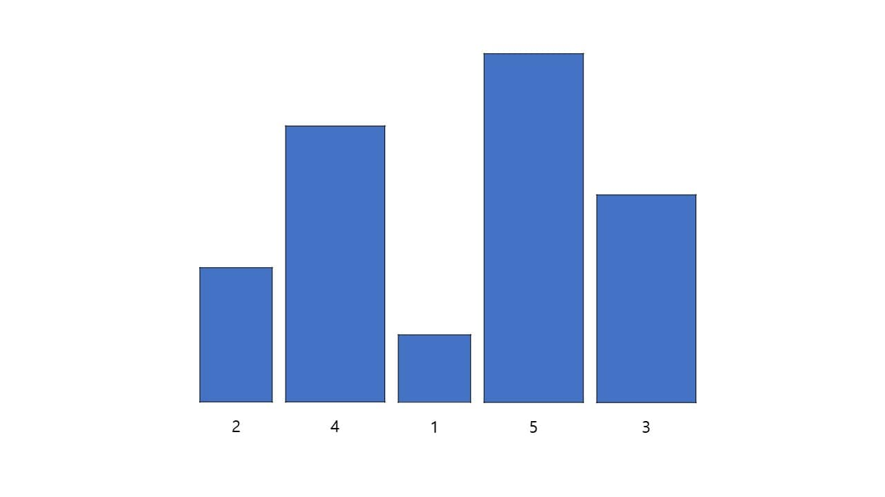

# Insertion sort

삽입 정렬은 2번째 원소부터 시작하여 그 앞(왼쪽)의 원소들과 크기를 비교하여 차례로 옮겨 크기 순으로 정렬하는 방법이다.

첫 번째 원소인 2와 두 번째 원소인 4를 비교한다. 첫 번째 원소보다 두 번째 원소가 크니 그대로 유지한다.

세 번째 원소인 1과 두 번째 원소인 4를 비교한다. 세 번째 원소가 더 작으니 세 번째 원소를 두 번째로 이동한다.
두 번째 원소가 된 1과 첫 번째 원소인 2를 비교한다. 두 번째 원소인 1이 첫 번째 원소인 2보다 작으니 두 번째 원소를 첫 번째로 이동한다.

네 번째 원소인 5와 세 번째 원소인 4를 비교한다. 네 번째 원소가 세 번째 원소보다 크니 그대로 유지한다.

다섯 번째 원소인 3과 네 번째 원소인 5를 비교한다. 다섯 번째 원소가 더 작으니 다섯 번째 원소를 네 번째로 이동한다.
네 번째 원소가 된 3과 세 번째 원소인 4를 비교한다. 네 번째 원소가 더 작으니 네 번째 원소를 세 번째로 이동한다.
세 번째 원소가 된 3과 두 번째 원소인 2를 비교한다. 세 번째 원소가 두 번째 원소보다 크니 그대로 유지한다.