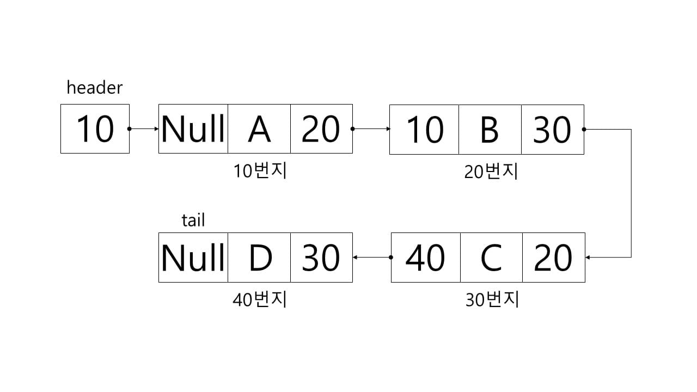
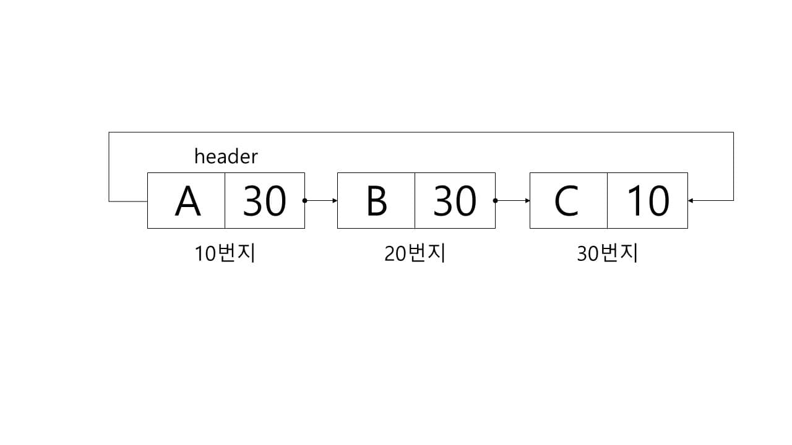
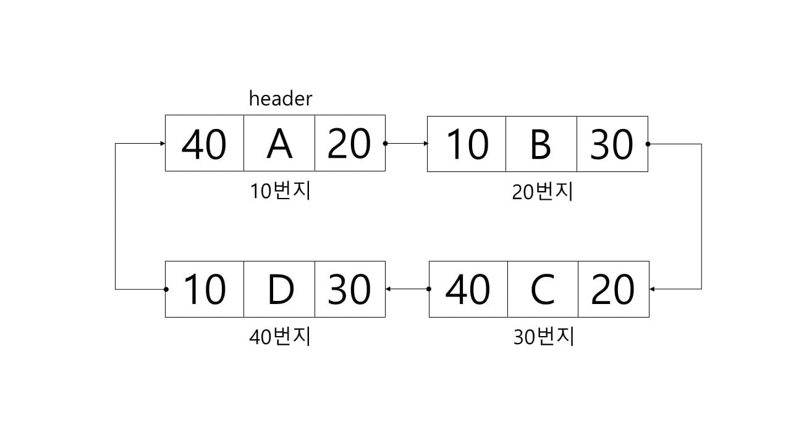

# Linked list

선형 리스트는 각 노드를 메모리 상에 서로 연속적인 공간에 저장하는 구조였다. 그러나 삽입과 삭제에 데이터 이동이 필수적으로 수행되는 단점을 가지고 있었다. 그래서 연속되지 않은 기억공간에 데이터를 저장하고 저장된 데이터의 주소를 갖는 구조를 연결 리스트라 한다. 

연결 리스트는 연속적인 기억공간이 필요하지 않으며 데이터의 삽입 삭제가 자유롭다. 그러나 데이터와 다음 노드의 주소도 저장하므로 기억공간이 많이 필요하고 임의의 노드를 탐색할 때 무조건 처음 노드부터 접근하므로 비효율적이다.

header : 처음 노드의 주소를 가리키는 포인터

tail : 다음 노드가 없어 null 값을 갖는 마지막 노드의 포인터

연결 리스트 각 노드의 첫 번째 필드는 데이터를 가지는 정보 필드, 두 번째 필드는 다음 노드를 가리키는 포인터인 링크 필드로 구성되어 있다.

연결 리스트에서 데이터를 삽입하기 위해서는 먼저 새로운 헤더를 생성하고 새로운 노드를 생성하여 가리키게 한다. 

그 후 새 노드의 링크 필드에 다음 노드의 주소를 저장하고, 앞 노드의 링크 필드에 새 노드의 주소를 저장한다. 

연결 리스트에서 데이터를 삭제하기 위해서는 삭제할 노드의 앞 노드를 찾아야 한다.

그 다음 삭제할 노드의 링크 필드의 값을 앞 노드에 저장한다.

노드에 하나의 링크 부분을 두고 한 쪽 방향으로만 노드를 찾을 수 있도록 제한된 단일 연결 리스트와 달리, 선형 구조를 이용하는 작업에 따라 양쪽 방향으로 찾는 것이 필요할 때도 있다. 이중 연결 리스트는 한 노드에서 두 개의 링크 부분을 갖고 서로 반대 방향의 노드를 가리키게 하면 노드를 양쪽 방향으로 탐색할 수 있게 된다.

마지막에 null 포인터를 갖는 단일 연결 리스트와 달리 마지막 노드의 링크가 첫 번째 노드를 가리키는 리스트를 환형(circular) 연결 리스트라고 한다.

이중 연결 리스트와 환형 연결 리스트를 모두 합친 것을 이중 환형 연결 리스트라고 한다.
이중 연결 리스트, 환형 연결 리스트와 이중 환형 연결 리스트를 합쳐서 다중 연결 리스트라고도 하는데, 이들의 삽입과 삭제는 연결 리스트와 동일하게 주소를 삽입하고 삭제하는 방식으로 이루어진다.