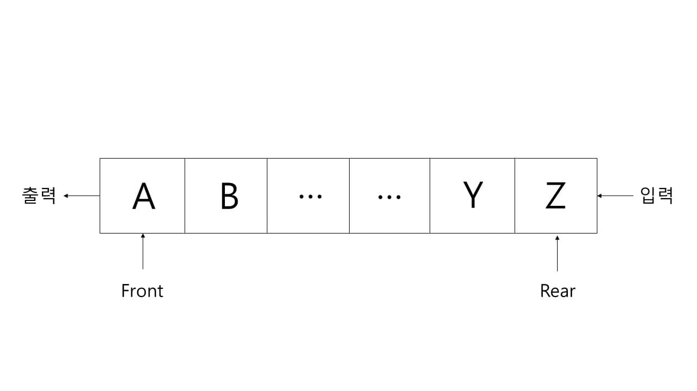
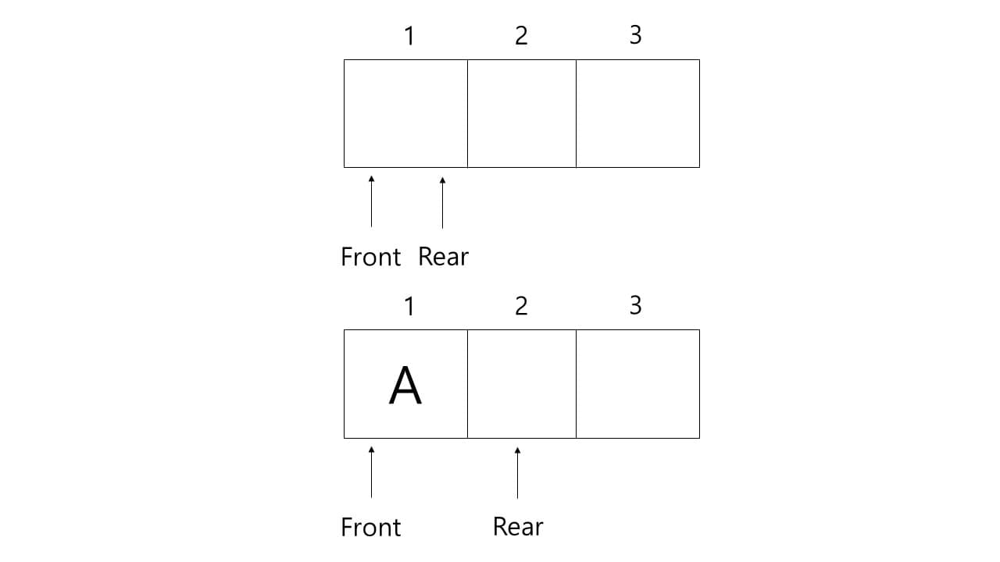
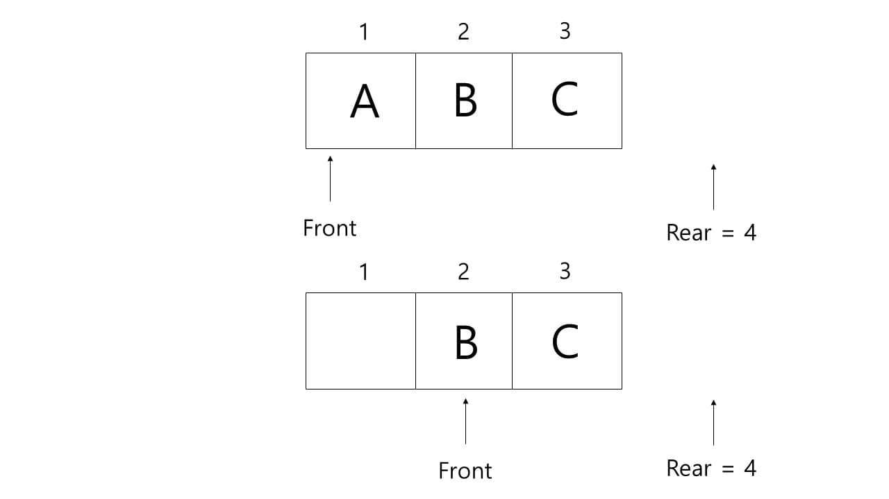

# Queue

원소의 삽입과 삭제가 서로 다른 쪽 끝에서 일어나는 선형 리스트

rear : 마지막으로 저장된 데이터를 가리키는 포인터(주소), tail 이라고도 한다. 

front : 처음으로 저장된 데이터를 가리키는 포인터(주소), head 라고도 한다.

\*큐 포인터는 삽입이 일어나는 부분, 삭제가 일어나는 부분 각각 1개씩 총 2개의 포인터를 사용한다.

저장된 데이터 항목들의 앞쪽 끝을 가리키는 front 포인터는 뒤쪽 끝을 가리키는 rear 포인터보다 큰 값을 가질 수 없다. 만약 두 값이 같다면 큐에 저장된 값이 없다는 의미이다.

초기에 front와 rear는 1의 값을 가진다. 데이터 A가 추가되면 현재 rear 포인터가 가리키는 곳에 데이터가 입력되고, rear 포인터는 1 증가된다.

데이터 삭제 시에는 현재 front 포인터가 가리키는 A를 삭제하고 front 포인터가 1 증가된다. B와 C가 삭제되면 front와 rear가 같아지며, 이러한 경우 언더플로우(Underflow)를 의미하게 된다.

또한 큐의 오버플로우(Overflow) 처리는 큐 내의 모든 데이터를 헤드 쪽으로 이동하는 방법과 큐를 환형 리스트로 운영하는 방법이 있다.

큐가 다음과 같은 상태일 때, 프로그램을 수행하면 오버플로우(Overflow)가 발생한다. 이 문제를 해결하기 위하여 왼쪽 그림과 같은 데이터들을 오른쪽과 같이 이동한 다음 처리하여야 한다. 그러나 이러한 이동 큐 방법은 데이터 이동 시간이 필요하고, 나눠져서 부분적으로 저장된 경우에는 오버헤드(Overhead)가 발생하므로 실제적인 해결방안이 될 수 없다.

환형 큐는 이동 큐의 문제점을 보완하기 위해 만들어진 구조이다. 삽입과 삭제 동작은 이동 큐와 같지만, 큐의 front와 rear가 서로 연결된 고리 모양을 하고 있어 사실 한계가 없는 것과 같다. front와 rear 두 개의 포인터는 초기에 시작점에서 출발하여 삽입과 삭제가 일어남에 따라 값이 증가하여 이동한다. 포인터가 큐의 끝에 있을 때 삽입과 삭제가 일어나면 reset되어 다시 시작점을 가리킨다. 이 경우에는 front와 rear가 같은 곳을 가리키면 오버플로우(Overflow)이다.