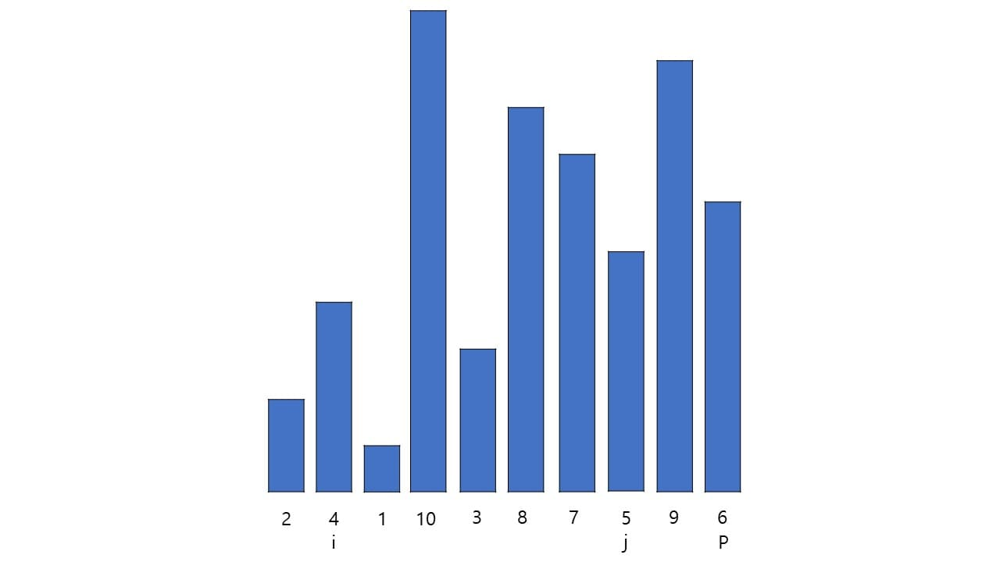
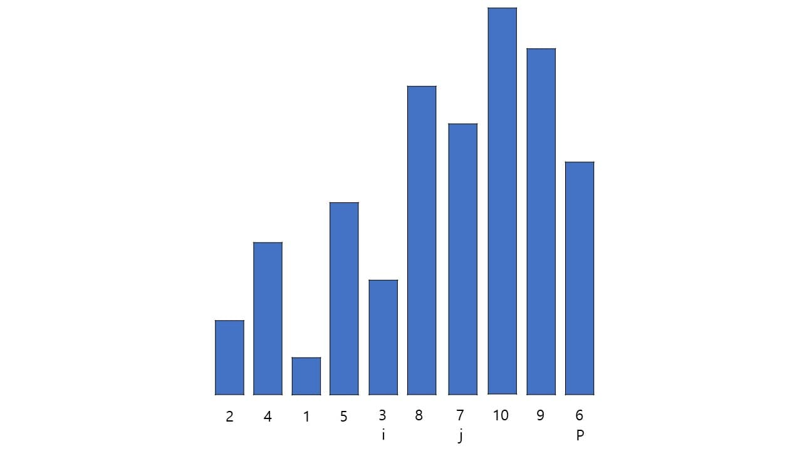
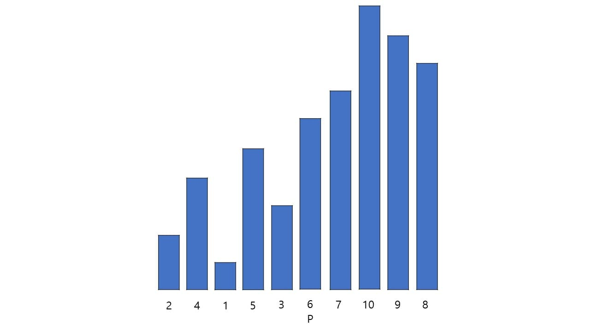

# Quick sort

퀵 정렬은 분할 정복(divide and conquer) 방법을 통해 리스트를 정렬한다.

리스트 가운데서 하나의 원소를 고른다. 이렇게 고른 원소를 피벗이라고 한다.
1. 피벗 앞에는 피벗보다 값이 작은 모든 원소들이 오고, 피벗 뒤에는 피벗보다 값이 큰 모든 원소들이 오도록 피벗을 기준으로 리스트를 둘로 나눈다. 이렇게 리스트를 둘로 나누는 것을 분할이라고 한다. 분할을 마친 뒤에 피벗은 더 이상 움직이지 않는다.
2. 분할된 두 개의 작은 리스트에 대해 재귀(Recursion)적으로 이 과정을 반복한다. 재귀는 리스트의 크기가 0이나 1이 될 때까지 반복된다.
3. 재귀 호출이 한번 진행될 때마다 최소한 하나의 원소는 최종적으로 위치가 정해지므로, 이 알고리즘은 반드시 끝난다는 것을 보장할 수 있다.

퀵 정렬을 하기 위한 초기 원소

피벗(P)으로 6을 선택한다. 피벗을 고르는 기준은 따로 없으며 어느 원소를 고르든 상관은 없다.
그리고 첫 번째 원소(i)와 피벗을 제외한 마지막 원소(j)를 고른다.

i가 P보다 작고 j가 P보다 크므로 그대로 유지한다.
i를 1 증가시키고 j를 1 감소시킨다.

i가 P보다 작고 j도 P보다 작으므로 그대로 유지한다.
이와 같은 경우는 P를 기준으로 i가 작고 j가 커야 하는데 i만 만족하므로 i만 이동한다.
i를 1 증가시킨다.

i가 P보다 작고 j도 p보다 작으므로 그대로 유지한다.
이와 같은 경우도 i만 만족하므로 i만 이동한다.
i를 1 증가시킨다.

i가 P보다 크고 j가 P보다 작으므로 둘이 교환한다.
이제 i와 j 둘 다 만족하므로 둘 다 이동한다.
i를 1 증가시키고 j를 1 감소시킨다.

i가 P보다 작고 j가 P보다 크므로 그대로 유지한다.
i를 1 증가시키고 j를 1 감소시킨다.

i가 P보다 크므로 i와 p를 교환한다.
이제 P를 기준으로 왼쪽은 전부 작고 오른쪽은 전부 크다.
퀵 정렬 1회전 완료.
이제 P를 제외한 왼쪽 {2, 4, 1, 5, 3}과 오른쪽 {7, 10, 9, 8}에 대하여 각각 피벗(P)을 선정하고 i와 j를 같은 방법으로 순환시켜 각각의 P를 정한다. 그런 식으로 반복하여 P가 전부 자리를 찾으면 퀵 정렬이 완료된다.