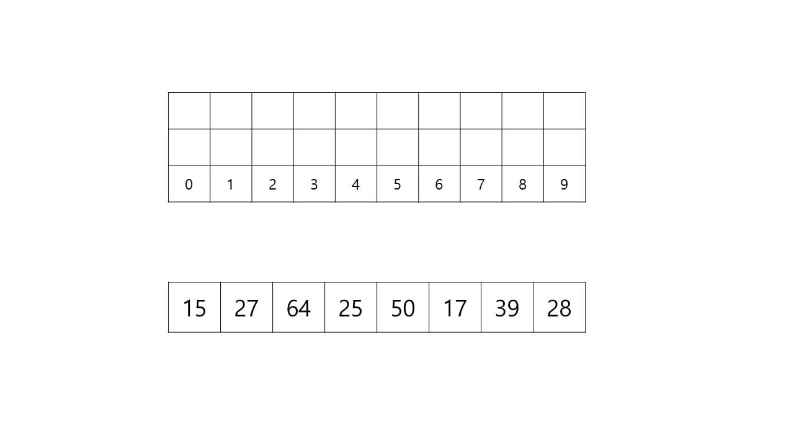
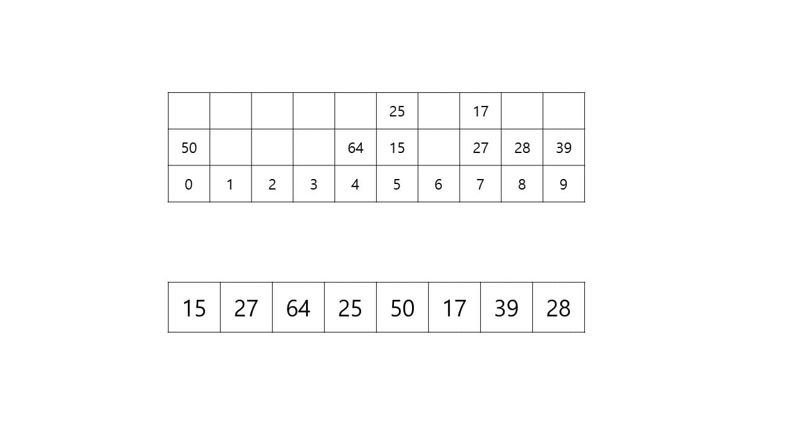
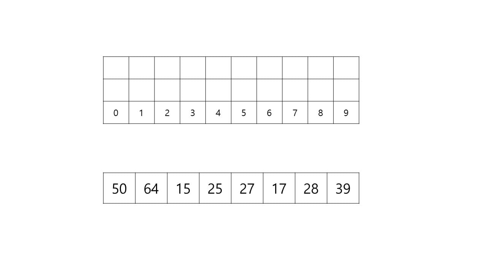
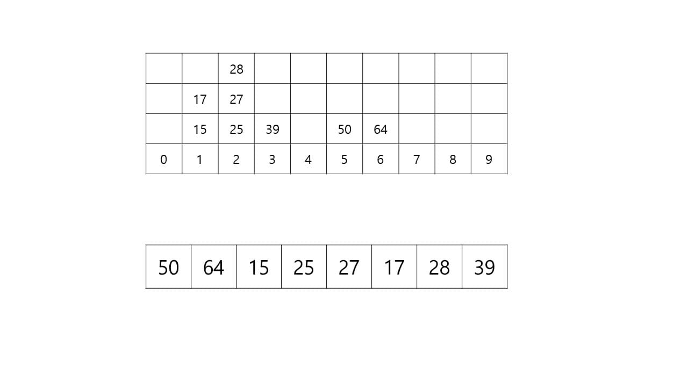
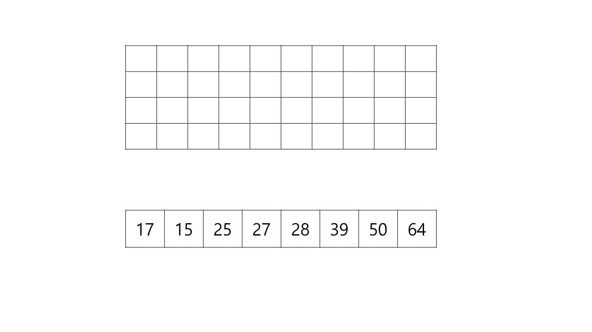

# Radix Sort

기수 정렬은 숫자의 자리수를 기준으로 하는 정렬 방법이다.

위의 큐는 기수 정렬을 하기 위한 큐이다. 
아래 배열은 기수 정렬을 하기 위한 초기 원소이다.

먼저 1의 자리수대로 배열의 원소들을 큐에 삽입한다.
50은 1의 자리수가 0, 64는 1의 자리수가 4, 15,25는 1의 자리수가 5이므로 각각의 자리에 삽입한다.

큐의 0번 원소부터 차례대로 배열에 저장한 모습이다.

다음 10의 자리수대로 배열의 원소들을 큐에 삽입한다.

큐의 0번 자리부터 차례대로 배열에 저장한 모습이다.