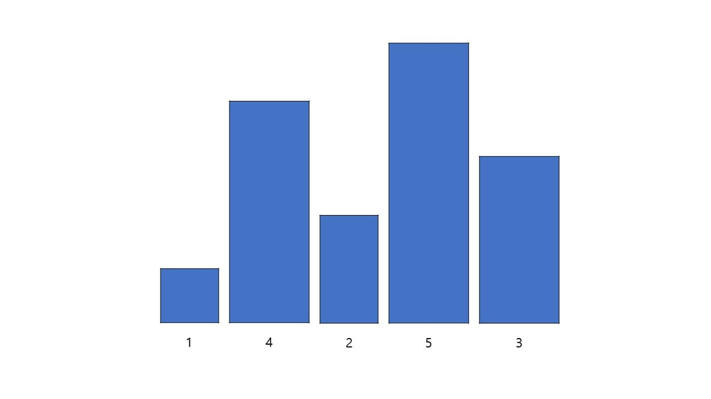

# Selection sort

선택 정렬은 원소의 자리를 기준으로 제일 작은 원소를 찾아 삽입하는 정렬 방법이다.

선택 정렬을 하기 위한 초기 원소

첫 번째 자리의 2와 두 번째부터 마지막까지의 원소를 비교하여 제일 작은 원소를 찾는다.
세 번째 자리의 1이 제일 작으니 첫 번째 자리의 2와 교체한다.
첫 번째 자리는 가장 작은 원소이므로 앞으로 비교하지 않는다.

두 번째 자리의 4와 세 번째부터 마지막까지의 원소를 비교하여 제일 작은 원소를 찾는다.
세 번째 자리의 2가 제일 작으니 두 번째 자리의 4와 교체한다.
두 번째 자리는 첫 번째 원소 다음으로 가장 작은 원소이므로 앞으로 비교하지 않는다.

세 번째 자리의 4와 네 번째부터 마지막까지의 원소를 비교하여 제일 작은 원소를 찾는다.
다섯 번째 자리의 3이 제일 작으니 세 번째 자리의 4와 교체한다.
세 번째 자리는 두 번째 원소 다음으로 가장 작은 원소이므로 앞으로 비교하지 않는다.

네 번째 자리의 5와 마지막의 원소를 비교하여 제일 작은 원소를 찾는다.
다섯 번째 자리의 4가 더 작으니 네 번째 자리의 5와 교체한다.