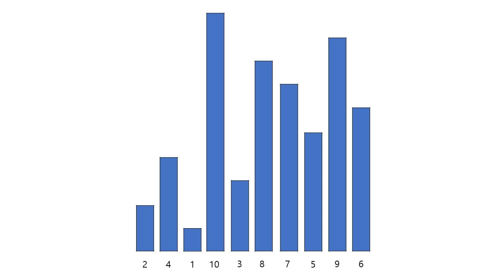
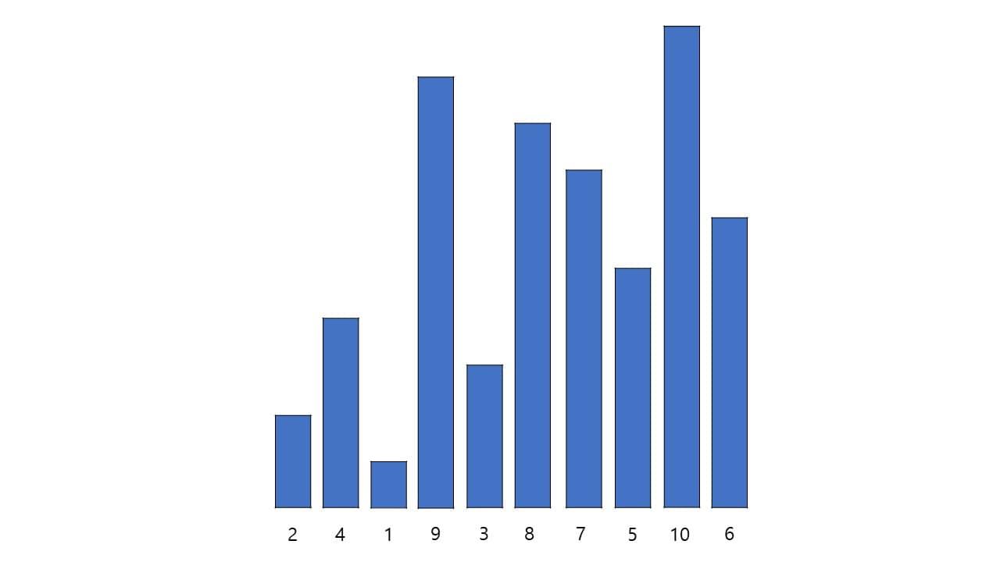
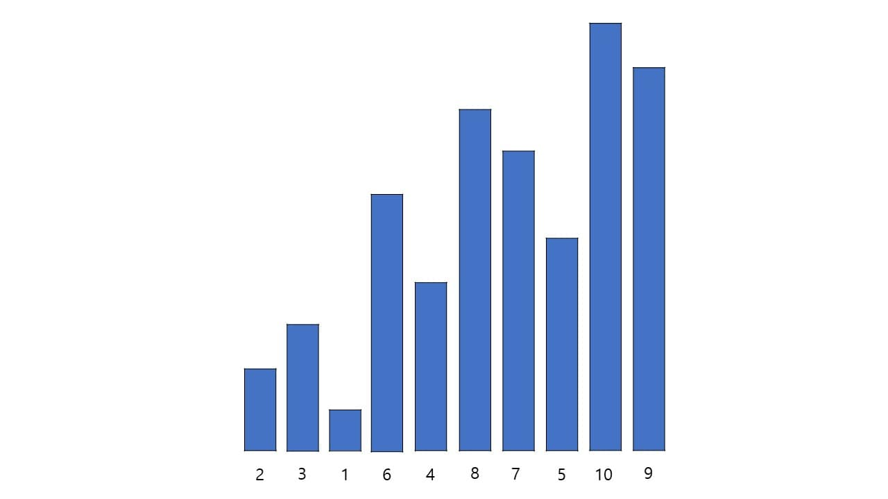
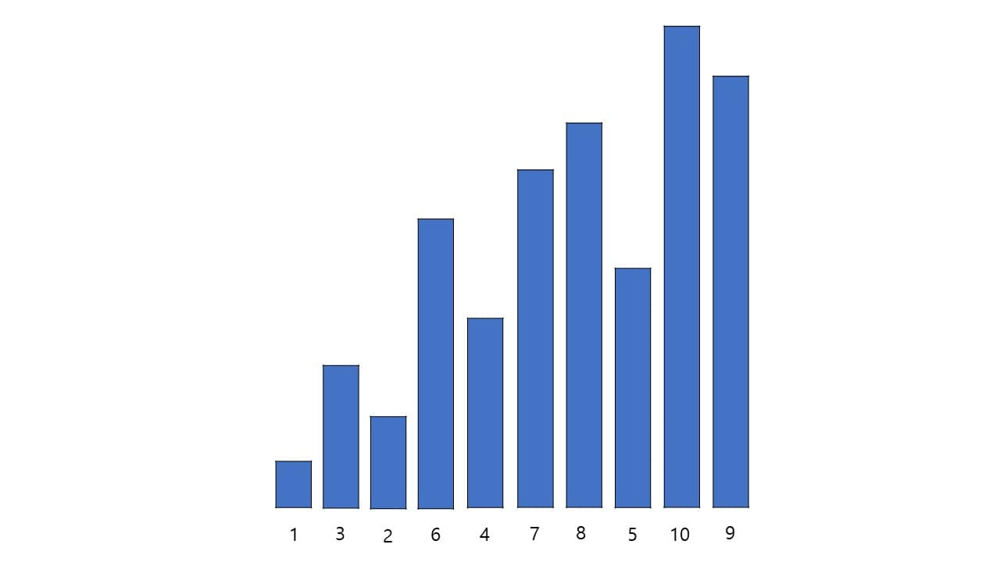
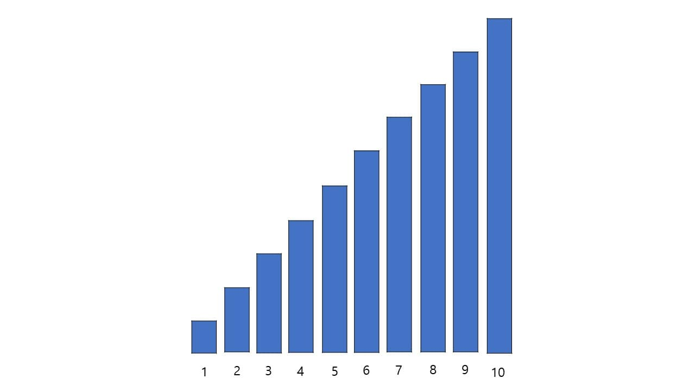

# Shell sort

이 정렬 방법을 발표한 창안자 도널드 쉘의 이름을 딴 쉘 정렬은,
삽입 정렬이 정렬이 거의 다 된 데이터일수록 정렬 속도가 굉장히 빨라진다는 장점을 이용하고 반대로 정렬이 안된 데이터일수록 정렬 효율이 굉장히 떨어진다는 단점을 보완하기 위한 정렬 방법이다.

쉘 정렬은 전체 데이터를 임의의 수로 나누어 삽입 정렬을 하는 방식이다. 임의의 수란 정확히 정해진 건 아니지만 대체적으로 데이터/2(소수점은 반올림) 하는 것이 일반적이다.

쉘 정렬을 하기 위한 초기 원소

10 / 2 = 5 이니 데이터 전체를 다섯 번째씩 분리하여 모으면 {2, 8}, {4, 7}, {1, 5}, {10, 9}, {3, 6}이다.
각각의 데이터끼리 삽입 정렬을 하게 되면 다음과 같다.
{2, 8} : 8보다 2가 작으니 그대로 유지
{4, 7} : 7보다 4가 작으니 그대로 유지
{1, 5} : 5보다 1이 작으니 그대로 유지
{10, 9} : 9보다 10이 크니 교환 = {9, 10}
{3, 6} : 6보다 3이 작으니 그대로 유지

5 / 2 = 3 (소수점 이하 반올림)이니 데이터 전체를 세 번째씩 분리하여 모으면 {2, 9, 7, 6}, {4, 3, 5}, {1, 8, 10}이다.
각각의 데이터끼리 삽입 정렬을 하게 되면 다음과 같다.
{2, 9, 7, 6} : 9보다 2가 작으니 그대로 유지
{2, 9, 7, 6} : 7보다 9가 크니 교환 = {2, 7, 9, 6}
{2, 7, 9 ,6} : 6보다 9가 크니 교환 = {2, 7, 6, 9}
{2, 7, 6, 9} : 6보다 7이 크니 교환 = {2, 6, 7, 9}
{4, 3, 5} : 3보다 4가 크니 교환 = {3, 4, 5}
{3, 4, 5} : 5보다 4가 작으니 그대로 유지
{1, 8, 10} : 8보다 1이 작으니 그대로 유지
{1, 8, 10} : 10보다 8이 작으니 그대로 유지

3 / 2 = 2 (소수점 이하 반올림)이니 데이터를 두 번째씩 분리하며 모으면 {2, 1, 4, 7, 10}, {3, 6, 8, 7, 9}이다.
각각의 데이터끼리 삽입 정렬을 하게 되면 다음과 같다.
{2, 1, 4, 7, 10} : 1이 2보다 작으니 교환 = {1, 2, 4, 7, 10}
{1, 2, 4, 7, 10} : 4가 2보다 크니 그대로 유지
{1, 2, 4, 7, 10} : 7이 4보다 크니 그대로 유지
{1, 2, 4, 7, 10} : 10이 7보다 크니 그대로 유지
{3, 6, 8, 7, 9} : 6이 3보다 크니 그대로 유지
{3, 6, 8, 7, 9} : 8이 6보다 크니 그대로 유지
{3, 6, 8, 7, 9} : 7이 8보다 작으니 교환 = {3, 6, 7, 8, 9}
{3, 6, 7, 8, 9} : 9가 8보다 크니 그대로 유지

2 / 2 = 1 이니 데이터 전체를 삽입 정렬한다.
{1, 3, 2, 6, 4, 7, 8, 5, 10, 9} : 3이 1보다 크니 그대로 유지한다.
{1, 3, 2, 6, 4, 7, 8, 5, 10, 9} : 2가 3보다 작으니 교환 = {1, 2, 3, 6, 4, 7, 8, 5, 10, 9}
{1, 2, 3, 6, 4, 7, 8, 5, 10, 9} : 6이 3보다 크니 그대로 유지한다.
{1, 2, 3, 6, 4, 7, 8, 5, 10, 9} : 4가 6보다 작으니 교환 = {1, 2, 3, 4, 6, 7, 8, 5, 10, 9}
{1, 2, 3, 4, 6, 7, 8, 5, 10, 9} : 7이 6보다 크니 그대로 유지한다.
{1, 2, 3, 4, 6, 7, 8, 5, 10, 9} : 8이 7보다 크니 그대로 유지한다.
{1, 2, 3, 4, 6, 7, 8, 5, 10, 9} : 5가 8보다 작으니 교환 = {1, 2, 3, 4, 6, 7, 5, 8, 10, 9}
{1, 2, 3, 4, 6, 7, 8, 5, 10, 9} : 5가 7보다 작으니 교환 = {1, 2, 3, 4, 6, 5, 7, 8, 10, 9}
{1, 2, 3, 4, 6, 7, 8, 5, 10, 9} : 5가 6보다 작으니 교환 = {1, 2, 3, 4, 5, 6, 7, 8, 10, 9}
{1, 2, 3, 4, 6, 7, 8, 5, 10, 9} : 10이 8보다 크니 그대로 유지
{1, 2, 3, 4, 6, 7, 8, 5, 10, 9} : 9가 10보다 작으니 교환 = {1, 2, 3, 4, 5, 6, 7, 8, 9, 10}