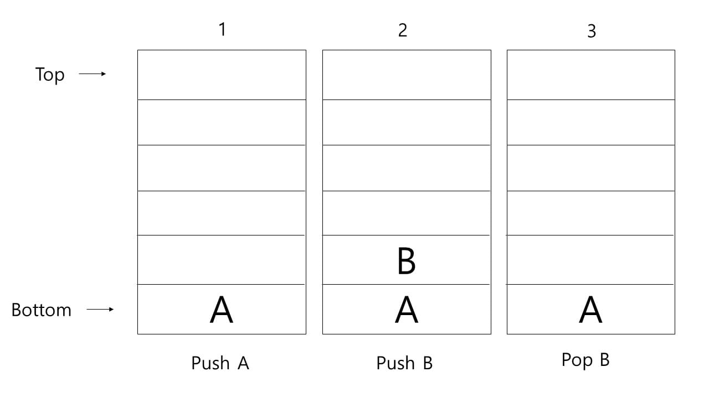
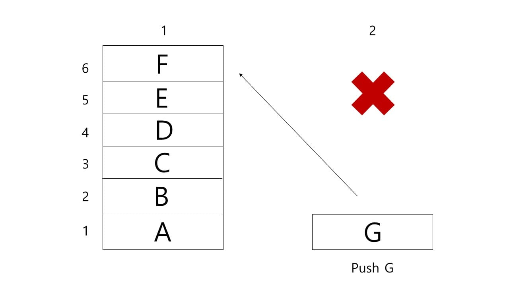
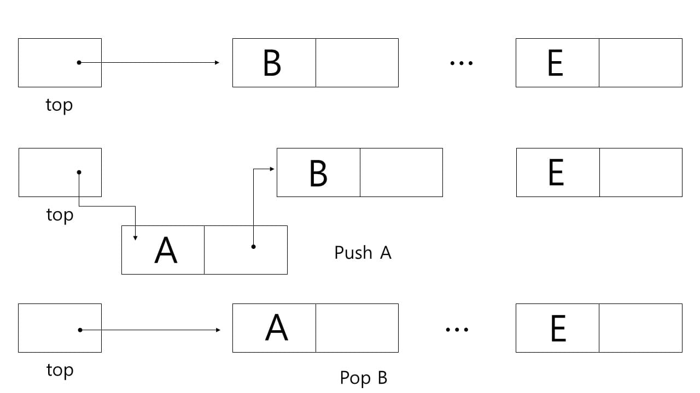

# Stack

원소의 삽입과 삭제가 한 쪽 끝에서만 일어나는 선형 리스트

top : 스택의 가장 마지막에 삽입된 데이터

bottom : 스택에 가장 처음으로 삽입된 데이터

push : 스택에 데이터를 삽입하는 것

pop : 스택에서 데이터를 꺼내는 것

\*스택 포인터는 스택의 top 위치를 가리키는 것임

매우 간단한 구조지만, 가장 나중에 삽입된 데이터부터 순차적으로 꺼내야 하는 특징이 있기 때문에 실행중인 프로그램에 관한 정보(함수나 서브루틴 등)을 저장해 놓기 용이하다.

스택의 용도에 따라 다르지만 일정한 기억공간을 사용할 땐 공간이 남아있는 지 확인해야 하고, 꽉 차있다면 오버플로우(Overflow)라 하며 더 이상 스택에 데이터를 삽입할 수 없다. 또한 기억공간이 가변일 경우에는 끝없이 늘어날 수 있으며 이 경우 top이 아닌 데이터들을 처리하는데 시간이 오래 걸릴 수 있다.

top이 0일 경우 언더플로우(Underflow), top이 n일 경우 오버플로우(Overflow)라 하는데, 이를 방지하기 위해 링크드 리스트(Linked List)를 이용할 수 있다.

