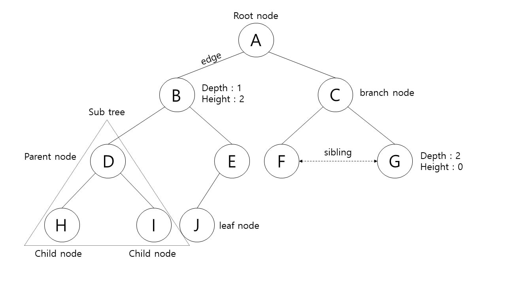
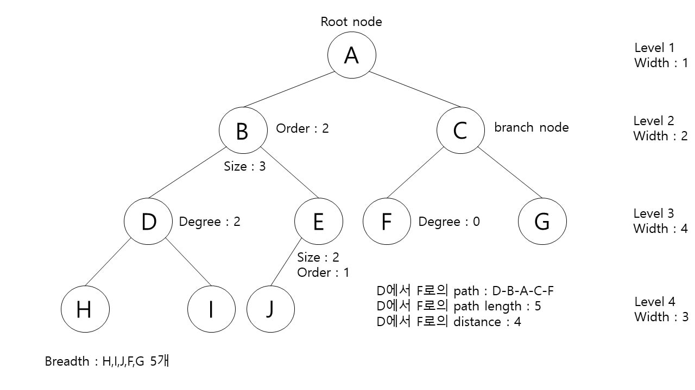

# Tree

트리란 노드들이 나무 가지처럼 연결되어 있는 비선형 계층적 자료구조이다.

node : 트리를 구성하고 있는 기본 요소인 데이터

edge : 노드와 노드 간의 연결선

root node : 트리 구조에서 부모가 없는 최상위 노드

parent node : 자식 노드를 가진 노드

child node : 부모 노드의 하위 노드

sibling node : 같은 부모를 가지는 노드

external node, outer node, leaf node : 자식 노드가 없는 노드

internal node, inner node, branch node : 자식 노드를 하나 이상 가진 노드

depth : 루트에서 어떤 노드까지의 간선(edge)의 수

height : 어떤 노드에서 리프 노드까지 가장 긴 경로의 간선(edge) 수

level : 루트에서 어떤 노드까지의 간선(edge) 수

degree : 노드의 자식 수

path : 한 노드에서 다른 한 노드에 이르는 길 사이에 놓인 노드들의 순서

path length : 해당 경로에 있는 노드들의 총합

size : 자신을 포함한 자손의 노드 수

width : 레벨에 있는 노드 수

breadth : 리프 노드의 수

distance : 두 노드 사이의 최단 경로에 있는 간선(edge)의 수

order : 자식 노드 중 가장 많은 자식을 가진 노드의 자식 노드 개수